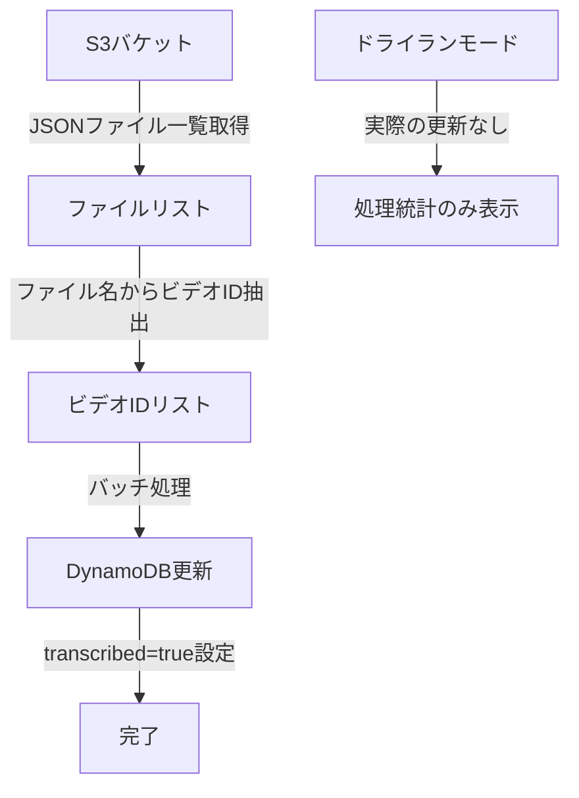

# S3 から DynamoDB Transcribe 属性更新スクリプト

このスクリプト（`update_transcribe_status.py`）は、指定した S3 バケットから JSON ファイル一覧を取得し、そのファイル名から抽出したビデオ ID を使って DynamoDB の`transcribed`属性を`true`に設定します。

## 🎯 用途

- S3 に保存されている音声転写ファイル（JSON ファイル）に対応する DynamoDB レコードを一括更新
- YouTube 動画の転写完了ステータスを効率的に管理
- バッチ処理による大量データの安全な更新

## 📋 前提条件

### 必要な環境変数 (.env ファイル)

```env
# AWS設定
S3_BUCKET_NAME=your-s3-bucket-name
AWS_ACCESS_KEY_ID=your-aws-access-key
AWS_SECRET_ACCESS_KEY=your-aws-secret-key
AWS_REGION=your-aws-region

# DynamoDBテーブル（オプション）
YOUTUBE_DYNAMODB_TABLE=youtube_videos
```

### 必要な Python パッケージ

```bash
pip install boto3 python-dotenv
```

## 🚀 使用方法

### 基本的な使用例

```bash
# 1. まずドライランモードでテスト（推奨）
python scripts/update_transcribe_status.py --dry-run

# 2. 実際の更新を実行
python scripts/update_transcribe_status.py

# 3. 特定のプレフィックスのファイルのみ対象
python scripts/update_transcribe_status.py --prefix audio4output/

# 4. バッチサイズを指定
python scripts/update_transcribe_status.py --batch-size 10

# 5. 詳細ログで実行
python scripts/update_transcribe_status.py --log-level DEBUG
```

### コマンドラインオプション

| オプション     | 説明                                  | デフォルト        |
| -------------- | ------------------------------------- | ----------------- |
| `--prefix`     | S3 検索プレフィックス                 | `""` (全ファイル) |
| `--batch-size` | バッチ処理サイズ                      | `25`              |
| `--dry-run`    | ドライランモード（実際の更新なし）    | `False`           |
| `--table-name` | DynamoDB テーブル名                   | 環境変数から取得  |
| `--log-level`  | ログレベル (DEBUG/INFO/WARNING/ERROR) | `INFO`            |

## 📊 処理フロー



## 📝 処理例

### 入力ファイル例

```
s3://my-bucket/audio4output/
├── -BvrYAPiRJw.json
├── nDA-VCVuK-Q.json
└── xtyUfN2FWYU.json
```

### ビデオ ID 抽出

```
S3キー: audio4output/-BvrYAPiRJw.json → ビデオID: -BvrYAPiRJw
S3キー: audio4output/nDA-VCVuK-Q.json → ビデオID: nDA-VCVuK-Q
S3キー: audio4output/xtyUfN2FWYU.json → ビデオID: xtyUfN2FWYU
```

### DynamoDB 更新

各ビデオ ID に対応するレコードの`transcribed`属性を`true`に設定

## 🔍 ドライランモード

実際の更新を行う前に、`--dry-run`オプションで動作確認ができます：

```bash
python scripts/update_transcribe_status.py --dry-run --log-level DEBUG
```

### ドライランモードの出力例

```
2025-09-27 10:00:00 - INFO - 🔍 DRY RUN MODE - 実際の更新は行いません
2025-09-27 10:00:01 - INFO - 発見したJSONファイル数: 241
2025-09-27 10:00:02 - INFO - 🔄 -BvrYAPiRJw: transcribed=false → true (DRY RUN)
2025-09-27 10:00:03 - DEBUG - ✅ nDA-VCVuK-Q: すでにtranscribed=true
2025-09-27 10:00:04 - WARNING - ⚠️ invalid-id: DynamoDBレコードが見つかりません
```

## 📈 処理統計

スクリプト実行後に表示される統計情報：

- **対象件数**: 処理対象のファイル数
- **処理済み**: 実際に処理されたレコード数
- **更新済み**: `transcribed`属性が更新されたレコード数
- **既に transcribed=true**: すでに更新済みのレコード数
- **レコード未発見**: DynamoDB に存在しないビデオ ID の数
- **失敗**: エラーで処理できなかったレコード数

## ⚠️ 注意事項

1. **ドライランでの事前確認**: 実際の処理前に必ず `--dry-run` で動作確認を行う
2. **バックアップ**: 重要なデータの場合は事前に DynamoDB をバックアップ
3. **権限**: S3 と DynamoDB への適切なアクセス権限が必要
4. **ファイル名規則**: S3 の JSON ファイル名がビデオ ID と一致している必要がある

## 🛠️ トラブルシューティング

### よくあるエラー

1. **環境変数未設定**

   ```
   必要な環境変数が設定されていません: ['S3_BUCKET_NAME']
   ```

   → `.env`ファイルで必要な環境変数を設定

2. **AWS 認証エラー**

   ```
   NoCredentialsError: Unable to locate credentials
   ```

   → AWS 認証情報を正しく設定

3. **DynamoDB レコードが見つからない**
   ```
   ⚠️ video-id: DynamoDBレコードが見つかりません
   ```
   → S3 ファイル名と DynamoDB のビデオ ID が一致しているか確認

### デバッグ方法

詳細なログでデバッグ：

```bash
python scripts/update_transcribe_status.py --log-level DEBUG --dry-run
```

## 🧪 テスト

環境確認とテストスクリプトを実行：

```bash
python scripts/test_update_script.py
```

このテストスクリプトは以下を確認します：

- 環境変数の設定状況
- 使用例の表示
- スクリプトの機能説明

## 📞 サポート

問題が発生した場合は、以下の情報と共にお問い合わせください：

- エラーメッセージの全文
- 実行したコマンド
- 環境変数の設定状況（機密情報は除く）
- ログレベル DEBUG での実行結果
